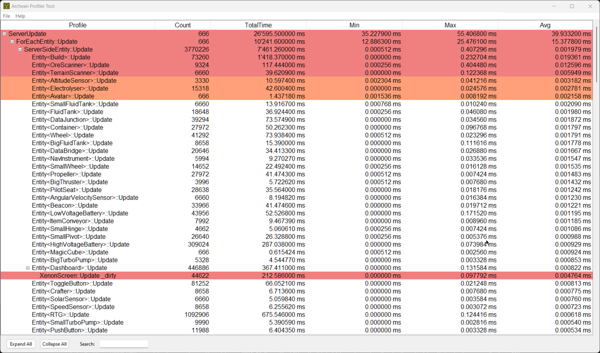

## Archean Profiler Analyzer
This program analyzes the performance of the game *Archean* by reading a CSV file containing profiling data. It displays this data in a tree structure, where each profile can contain sub-profiles in a hierarchy. The user can explore this hierarchy, sort the data by various criteria such as average or total time, and search for specific profiles.

The program highlights the profiles with the worst performance to help identify bottlenecks. It also offers options to expand or collapse all nodes in the tree and includes a menu to open files and access help on the coloring system.

An executable for Windows was created using PyInstaller.
___

